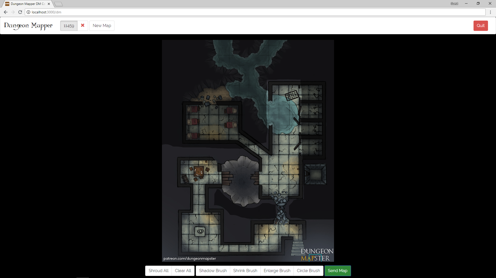
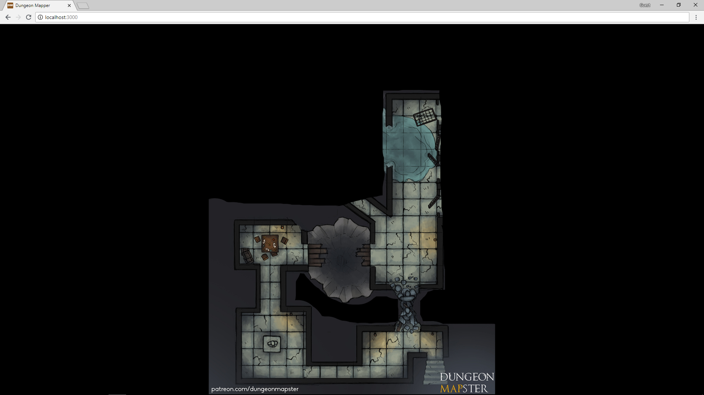

# Dungeon Mapper &emsp; [](https://travis-ci.org/Crainbows/dungeon-mapper) [](https://requires.io/github/Crainbows/dungeon-mapper/requirements/) [](https://github.com/Crainbows/dungeon-mapper) [](https://github.com/Crainbows/dungeon-mapper) [](https://github.com/Crainbows/dungeon-mapper)
> Display digital maps to players of tabletop RPGs

This web app for tabletop RPGs allows the Dumgeon Master to reveal selected areas of a digital map to players. This allows you to keep certain areas of the map hidden from the players until they discover them.

### DM's View

### Players View


Originally forked from [apclary/dungeon-revealer](https://github.com/apclary/dungeon-revealer), now updated, refactored and maintained with new features.

Example images used above from [Dungeon Mapster.](https://patreon.com/dungeonmapster/)
## Installing / Getting started

If you are happy using git, node and npm/yarn it is as simple as:
```shell
git clone https://github.com/Crainbows/dungeon-mapper.git
npm install
npm start
```
Otherwise you'll need the following:
1. Install git. On Windows, I believe if you install the Github version of git it should add git automatically to your path.
2. Go to https://nodejs.org/download/ and download and install Node. Node is the runtime for this software, which basically means you need it to make the software work. Only one person needs Node (assumed to be the DM). 
3. Once Node is installed, open a command prompt. 
  * For Mac users, press Command + Space and type "terminal" into Spotlight. Press enter and a prompt should open. 
  * For Windows users, press the Windows key and type "command prompt" or "cmd" into the search box and then press enter.
  * For Linux users, you already know how to open the command prompt.
4. Using the command prompt, change to whatever directory you want to keep this program in. 
5. Once you are in that directory, type `git clone https://github.com/Crainbows/dungeon-mapper.git ./` into the command prompt and press enter.
6. Then type `npm install` into the command prompt and press enter and wait a little bit while it installs.
7. Once it's done type `npm start` into the prompt. Some messages should appear letting you know where to naviagte to in your web browser.

  * On some Windows machines, a firewall prompt will appear. Check all of the checkboxes and click OK.

## Usage

Once you have run `npm start` you should be given a local ip address for your players to use. If they enter this address in their browsers they will be ready to go.

The DM needs to navigate to http://localhost:3000/dm on the same device the server was started on. They will then be able to begin uploading maps and removing the fog of war. Maps will remain until deleted but currently fog of war data will be deleted as soon as the DM browser window closes. If you have multiple displays or want to use streaming devices such as chromecast the DM can also open a second window and browse to http://localhost:3000 to see the same view as the players.

Once finished clicking the Quit button will shutdown the server.

## Developing

If you are interested in developing this project further get the dev dependencies to allow for testing and linting:

```shell
git clone https://github.com/Crainbows/dungeon-mapper.git
cd dungeon-mapper/
npm install --save-dev
```
We are open to pull requests and new features and ideas.

### Built With
- Vue.js
- Jest
- Webpack
- Laravel Mix
- Dropzone.js

## Versioning

We can maybe use [SemVer](http://semver.org/) for versioning. For the versions available, see the [link to tags on this repository](/tags).

## Style guide

We currently use eslint:reccomended with slight modifications.

## Licensing

[MIT](/LICENSE)